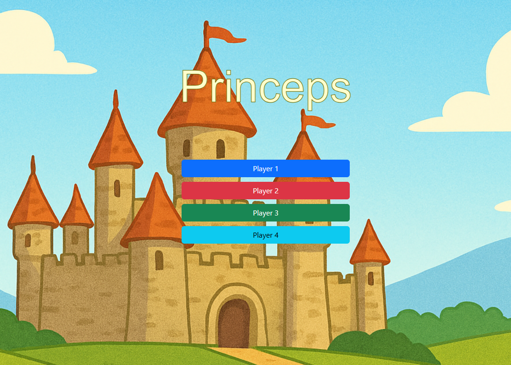
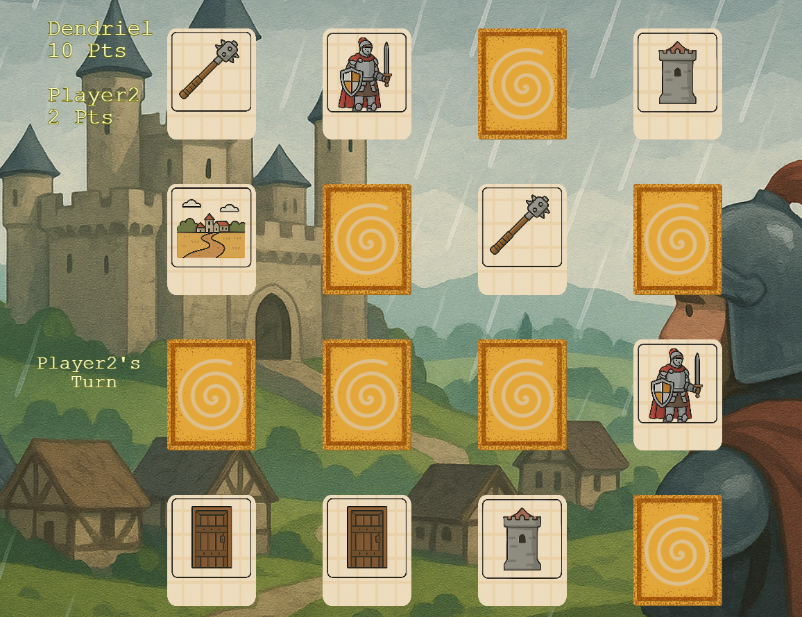

# Princeps - Memory Game

The Princeps project is an online Web Memory Game to be played up to 4 players.

The game client and server are written using `Typescript` language, `Phaser` for game engine and `Rozsa MOGS` (a
multiplayer lib over Socket.io) for Websocket communication.

# Game screenshots

## TODO

- Add labels to the cards.
- Add a message-log (or a chat) to improve the notifications experience
- As now rozsa-mogs supports sharing client info while connecting, move 'nickname' setting to connection
- Add timeout so game-server can auto-shutdown automatically if the match is not started or it is abandoned