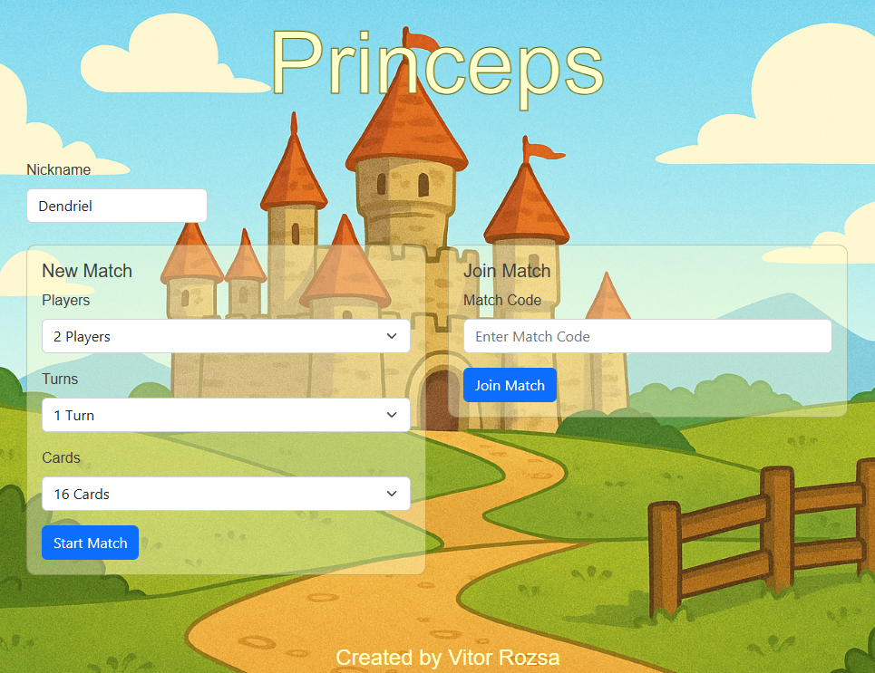

# Princeps - Memory Game

The Princeps project is an online Web Memory Game to be played up to 4 players.

The game client and server are written using `Typescript` language, `Phaser` for game engine and `Rozsa MOGS` (a
multiplayer lib over Socket.io) for Websocket communication. Also, the game is hosted on AWS.

# Game screenshots

## Features

- Multiplayer Online Game
- Websocket network communication with authoritative server (client-server arch)
- Lobby and Matchmaking support
  - Lobby sharing via code
  - *Matchmaking mode needs to be reactivated in the code and needs an extra service to create the matches
- Allows players to reconnect to the match
- Configuration-based content
- Game server auto-shutdown (when maximum time or no connected players)

*Not very well-supported in mobile browsers.

## TODO

- Allow displaying players entering the lobby
  - This requires to change the phaser loading step to the moment the players enter the lobby
  - It will allow us to show message while in the lobby
- Allow players to send messages in the chat
- Add sounds

## NTH

- Add a browser icon
- Scale the game automatically accordingly with the screen size
- Configure a logging agent to push logs to Cloud

## Known Issues

- Text chat can start having an odd offset as more messages are added.
  - Chrome and Edge are fine, but Firefox reproduces this issue