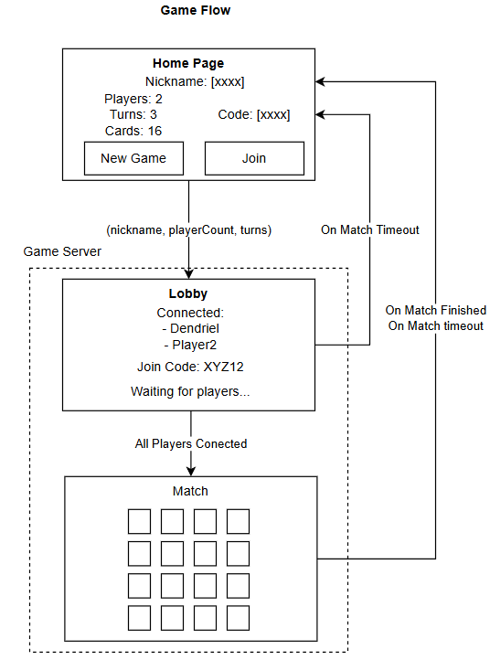
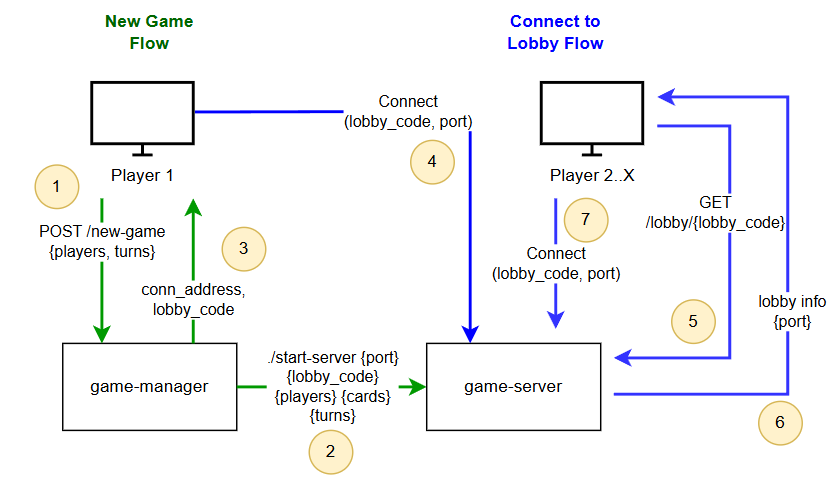
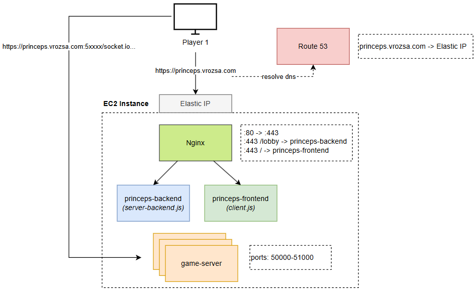

# Solution Docs

Some diagrams about the game solution.

## Game Flow (mockups)

Game windows/scenes transitions.



## Connection Flow

What should happen in the backend to support the game-flow.



Basic flow:
1. The `client` (player) requests a New Game to the `game-manager`
2. The `game-manager` validates the input config and starts a new game server at a random port and lobby-code
3. The `game-manager` stores the lobby information and returns the lobby-code and port to the `client`
4. The `client` connects to the `game-server` using the provided port number and lobby-code
5. Having shared the lobby-code with friends, other clients can use it to ask the `game-manager` for the lobby information
6. The `game-manager` finds the lobby information via lobby code and provide it to the `new client`
7. The `new client` connects to the `game-server` using the provided port number and lobby-code

> For a high-throughput scenario, to achieve scalability and elasticity, we could use an auto-registering agent strategy. In this approach, we would have an agent process responsible for handling the game-servers and for auto-registering available game-server capacity to a central manager. This way, by using scaling groups in AWS, we could have new EC2 instances being booted on demand and the agents automatically making the central-manager aware of them.

## Infrastructure

An oversimplified representation of the infrastructure:




## Solution Remarks

- The player is able to create servers freely, so any ill-intended player can overload the server and make it unavailable
  - For a production game, we could track the new matches a player is creating and limit then (best if blocking by IP).
- Instead of providing the client resources via CDN, for simplicity, I've chosen to provide it directly from the
game-server instance
- To be able to keep the service running 24/7, I'm using economical (~~cheap~~ :p) amazon spot-instances which may be
interrupted at any moment and may disrupt the player matches. I've set the interruption behavior to 'hibernate', which
should restore the instance state when a new spot is assigned. With a bit of luck, the game may be restored in a few
minutes =] (idk)


# Infrastructure Setup


## EC2 Instance

### Server Backend

```shell
sudo yum update -y
sudo yum install git -y
sudo yum install -y nodejs

git clone https://github.com/dendriel/princeps.git

cd princeps
npm i
npm run build
```

### Nginx

```shell
# Configure Access
sudo yum install nginx -y

sudo mkdir /etc/nginx/sites-available
sudo mkdir /etc/nginx/sites-enabled

sudo vi /etc/nginx/sites-available/princeps-express # add server config (cfg bellow)
sudo ln /etc/nginx/sites-available/princeps-express /etc/nginx/sites-enabled/
sudo vi /etc/nginx/nginx.conf # make nginx aware of the config (cfg bellow)

sudo nginx -t # check the config
sudo systemctl start nginx # start the service (or reload if already active)

# Configure HTTPS

sudo yum install certbot python3-certbot-nginx -y
sudo certbot --nginx -d princeps.vrozsa.com
```

#### `princeps-express` base server config for Nginx
```
server {
listen 80;
server_name princeps.vrozsa.com;

    # Web Backend config
    location /lobby {
        proxy_pass http://localhost:8000;
        proxy_http_version 1.1;
        proxy_set_header Upgrade $http_upgrade;
        proxy_set_header Connection 'upgrade';
        proxy_set_header Host $host;
        proxy_cache_bypass $http_upgrade;
    }
    
    # Frontend config (client)
    location / {
        proxy_pass http://localhost:8080;
        proxy_http_version 1.1;
        proxy_set_header Upgrade $http_upgrade;
        proxy_set_header Connection 'upgrade';
        proxy_set_header Host $host;
        proxy_cache_bypass $http_upgrade;
    }
}
```
*Certbot will update this config latter.

Also, if not present, add `include /etc/nginx/sites-enabled/*;` to `/etc/nginx/nginx.conf` inside the `http` block.

## Frontend and Backend as services

Set the frontend and backend as services to auto-restart.

> Note: the certificate private-key and chain file path will be available into `/etc/nginx/nginx.conf` after setting up
> the certbot.

Create a file at `/etc/systemd/system/princeps-backend.service` and past the config:
```
[Unit]
Description=Princeps Backend
After=network.target

[Service]
ExecStart=/usr/bin/node /home/ec2-user/princeps/server-backend.js
WorkingDirectory=/home/ec2-user/princeps
Restart=always
User=root

Environment=PRINCEPS_SSL_KEY={TODO: add the certificate-key path here}
Environment=PRINCEPS_SSL_CERT={TODO: add the certificate path here}

StandardOutput=append:/home/ec2-user/backend.log
StandardError=append:/home/ec2-user/backend.log

[Install]
WantedBy=multi-user.target
```

Create a file at `/etc/systemd/system/princeps-frontend.service` and past the config:
```
[Unit]
Description=Princeps Frontend
After=network.target

[Service]
ExecStart=/usr/bin/node /home/ec2-user/princeps/client.js
WorkingDirectory=/home/ec2-user/princeps
Restart=always
User=root

StandardOutput=append:/home/ec2-user/frontend.log
StandardError=append:/home/ec2-user/frontend.log

[Install]
WantedBy=multi-user.target
```

Start both services:

```
sudo systemctl start princeps-backend
sudo systemctl start princeps-frontend
```

## Game Server

The Game Servers listens to port range `50000-51000`, so the EC2 security group must also allow these ports.

The Game Server also use HTTPS, but this is configured via env vars `PRINCEPS_SSL_KEY` and `PRINCEPS_SSL_KEY` in the
princeps-backend service.


# Releasing new versions

It is as easy as pulling the new code, building the app and restarting the services:

```shell
cd princeps
git pull
npm run build
sudo systemctl restart princeps-backend
sudo systemctl restart princeps-frontend
```